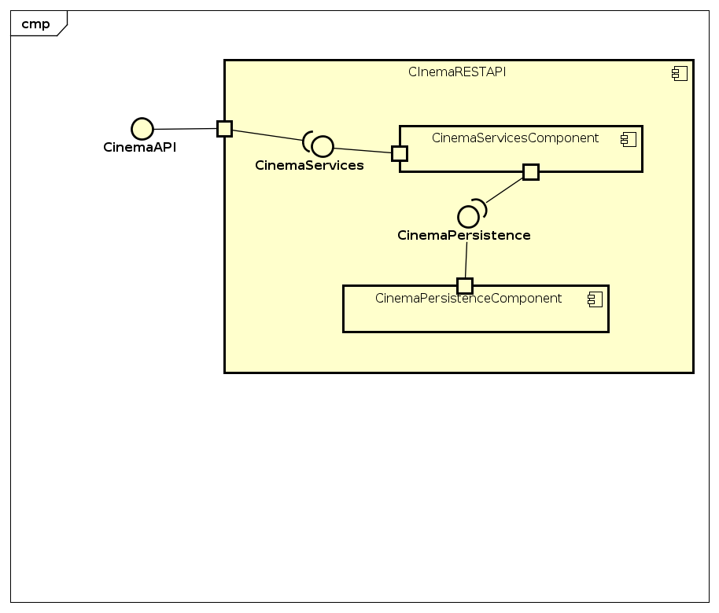

### Escuela Colombiana de Ingeniería

### Arquitecturas de Software


#### API REST para la gestión de compra/reserva de boletos de cine.

En este ejercicio se va a construír el componente CinemaRESTAPI, el cual permita gestionar la reserva de boletos de una prestigiosa compañia de cine. La idea de este API es ofrecer un medio estandarizado e 'independiente de la plataforma' para que las herramientas que se desarrollen a futuro para la compañía puedan gestionar los boletos de forma centralizada.
El siguiente, es el diagrama de componentes que corresponde a las decisiones arquitectónicas planteadas al inicio del proyecto:



Donde se definió que:

* El componente CinemaRESTAPI debe resolver los servicios de su interfaz a través de un componente de servicios, el cual -a su vez- estará asociado con un componente que provea el esquema de persistencia. Es decir, se quiere un bajo acoplamiento entre el API, la implementación de los servicios, y el esquema de persistencia usado por los mismos.

Del anterior diagrama de componentes (de alto nivel), se desprendió el siguiente diseño detallado, cuando se decidió que el API estará implementado usando el esquema de inyección de dependencias de Spring (el cual requiere aplicar el principio de Inversión de Dependencias), la extensión SpringMVC para definir los servicios REST, y SpringBoot para la configurar la aplicación:


### Parte I

1. Integre al proyecto base suministrado los Beans desarrollados en el [Ejercicio Anterior](https://github.com/ARSW-ECI-beta/REST_API-SpringBoot-Cinema_Base). Sólo copie las clases, NO los archivos de configuración. Rectifique que se tenga correctamente configurado el esquema de inyección de dependencias con las anotaciones @Service y @Autowired.

2. Modifique el bean de persistecia 'InMemoryCinemaPersistence' para que por defecto se inicialice con al menos otras 2 salas de cine, y al menos 2 funciones asociadas a cada una.

3. Configure su aplicación para que ofrezca el recurso "/cinema", de manera que cuando se le haga una petición GET, retorne -en formato jSON- el conjunto de todos los cines. Para esto:

	* Modifique la clase CinemaAPIController teniendo en cuenta el siguiente ejemplo de controlador REST hecho con SpringMVC/SpringBoot:

	```java
	@RestController
	@RequestMapping(value = "/url-raiz-recurso")
	public class XXController {
    
        
    @RequestMapping(method = RequestMethod.GET)
    public ResponseEntity<?> manejadorGetRecursoXX(){
        try {
            //obtener datos que se enviarán a través del API
            return new ResponseEntity<>(data,HttpStatus.ACCEPTED);
        } catch (XXException ex) {
            Logger.getLogger(XXController.class.getName()).log(Level.SEVERE, null, ex);
            return new ResponseEntity<>("Error bla bla bla",HttpStatus.NOT_FOUND);
        }        
	}

	```
	* Haga que en esta misma clase se inyecte el bean de tipo CinemaServices (al cual, a su vez, se le inyectarán sus dependencias de persistencia y de filtrado de películas).
	* De ser necesario modifique el método getAllCinemas(), de manera que utilice la persistencia previamente inyectada y retorne todos los cines registrados.

4. Verifique el funcionamiento de a aplicación lanzando la aplicación con maven:

	```bash
	$ mvn clean compile
	$ mvn spring-boot:run
	```
	Y luego enviando una petición GET a: http://localhost:8080/cinemas. Rectifique que, como respuesta, se obtenga un objeto jSON con una lista que contenga el detalle de los cines suministados por defecto.


5. Modifique el controlador para que ahora, acepte peticiones GET al recurso /cinemas/{name}, el cual retorne usando una representación jSON todas las funciones del cine cuyo nombre sea {name}. Si no existe dicho cine, se debe responder con el código de error HTTP 404. Para esto, revise en [la documentación de Spring](http://docs.spring.io/spring/docs/current/spring-framework-reference/html/mvc.html), sección 22.3.2, el uso de @PathVariable. De nuevo, verifique que al hacer una petición GET -por ejemplo- a recurso http://localhost:8080/cinemas/cinemaY	, se obtenga en formato jSON el conjunto de funciones asociadas al cine 'cinemaY' (ajuste esto a los nombres de cine usados en el punto 2).

6. Modifique el controlador para que ahora, acepte peticiones GET al recurso /cinemas/{name}/{date}, el cual retorne usando una representación jSON una lista de funciones asociadas al cine cuyo nombre es {name} y cuya fecha sea {date}, para mayor facilidad se seguirá manejando el formato "yyyy-MM-dd". De nuevo, si no existen dichas funciones, se debe responder con el código de error HTTP 404. 
7. Modifique el controlador para que ahora, acepte peticiones GET al recurso /cinemas/{name}/{date}/{moviename}, el cual retorne usando una representación jSON sólo UNA función, en este caso es necesario detallar además de la fecha, la hora exacta de la función de la forma "yyyy-MM-dd HH:mm". Si no existe dicha función, se debe responder con el código de error HTTP 404.


### Parte II

1.  Agregue el manejo de peticiones POST (creación de nuevas funciones), de manera que un cliente http pueda registrar una nueva función haciendo una petición POST al recurso ‘cinemas’, y enviando como contenido de la petición todo el detalle de dicho recurso a través de un documento jSON. Para esto, tenga en cuenta el siguiente ejemplo, que considera -por consistencia con el protocolo HTTP- el manejo de códigos de estados HTTP (en caso de éxito o error):

	```	java
	@RequestMapping(method = RequestMethod.POST)	
	public ResponseEntity<?> manejadorPostRecursoXX(@RequestBody TipoXX o){
        try {
            //registrar dato
            return new ResponseEntity<>(HttpStatus.CREATED);
        } catch (XXException ex) {
            Logger.getLogger(XXController.class.getName()).log(Level.SEVERE, null, ex);
            return new ResponseEntity<>("Error bla bla bla",HttpStatus.FORBIDDEN);            
        }        
 	
	}
	```	


2.  Para probar que el recurso ‘cinemas’ acepta e interpreta
    correctamente las peticiones POST, use el comando curl de Unix. Este
    comando tiene como parámetro el tipo de contenido manejado (en este
    caso jSON), y el ‘cuerpo del mensaje’ que irá con la petición, lo
    cual en este caso debe ser un documento jSON equivalente a la clase
    Cliente (donde en lugar de {ObjetoJSON}, se usará un objeto jSON correspondiente a una nueva función:

	```	
	$ curl -i -X POST -HContent-Type:application/json -HAccept:application/json http://URL_del_recurso_cinemas -d '{ObjetoJSON}'
	```	

	Con lo anterior, registre un nueva función (para 'diseñar' un objeto jSON, puede usar [esta herramienta](https://jsoneditoronline.org)):
	

	**Nota:** puede basarse en el formato jSON mostrado en el navegador al consultar una función con el método GET.


3. Teniendo en cuenta el nombre del cine, la fecha y hora de la función y el nombre de la película, verifique que el mismo se pueda obtener mediante una petición GET al recurso '/cinemas/{name}/{date}/{moviename}' correspondiente.

4. Agregue soporte al verbo PUT para los recursos de la forma '/cinemas/{name}/{date}/{moviename}/{row}/{col}, de manera que sea posible comprar un boleto de determinada función.


### Parte III

El componente CinemaRESTAPI funcionará en un entorno concurrente. Es decir, atederá múltiples peticiones simultáneamente (con el stack de aplicaciones usado, dichas peticiones se atenderán por defecto a través múltiples de hilos). Dado lo anterior, debe hacer una revisión de su API (una vez funcione), e identificar:

* Qué condiciones de carrera se podrían presentar?
* Cuales son las respectivas regiones críticas?

Ajuste el código para suprimir las condiciones de carrera. Tengan en cuenta que simplemente sincronizar el acceso a las operaciones de persistencia/consulta DEGRADARÁ SIGNIFICATIVAMENTE el desempeño de API, por lo cual se deben buscar estrategias alternativas.

Escriba su análisis y la solución aplicada en el archivo ANALISIS_CONCURRENCIA.txt

#### Criterios de evaluación

1. Diseño.
	* Al controlador REST implementado se le inyectan los servicios implementados en el laboratorio anterior.
	* Todos los recursos asociados a '/cinemas' están en un mismo Bean.
	* Los métodos que atienden las peticiones a recursos REST retornan un código HTTP 202 si se procesaron adecuadamente, y el respectivo código de error HTTP si el recurso solicitado NO existe, o si se generó una excepción en el proceso (dicha excepción NO DEBE SER de tipo 'Exception', sino una concreta)	
2. Funcionalidad.
	* El API REST ofrece los recursos, y soporta sus respectivos verbos, de acuerdo con lo indicado en el enunciado.
3. Análisis de concurrencia.
	* En el código, y en las respuestas del archivo de texto, se tuvo en cuenta:
		* La colección usada en InMemoryCinemaPersistence no es Thread-safe (se debió cambiar a una con esta condición).
		* El método que agrega un nuevo plano está sujeta a una condición de carrera, pues la consulta y posterior agregación (condicionada a la anterior) no se realizan de forma atómica. Si como solución usa un bloque sincronizado, se evalúa como R. Si como solución se usaron los métodos de agregación condicional atómicos (por ejemplo putIfAbsent()) de la colección 'Thread-Safe' usada, se evalúa como B.
